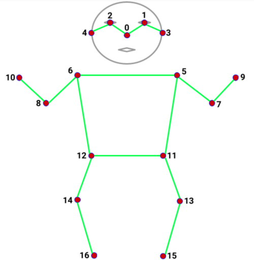

# Processors

## LandmarkNormalVector
A Processor that takes in a LandmarkData object and computes the normal vector on a specific landmark.

#### Inputs

- **LandmarkData**: The landmarks to which the one euro filter should be applied.

#### Returns

- **NormalVectorData**: The normal vector of the landmark.

#### Arguments

| Name | Description |
| ---- | ----------- |
| landmark | The landmark to which the normal vector should be computed. |
| ref_landmarks | The reference landmarks to use for the normal vector computation. |
| tip_scale | The scale factor for the normal vector (default: 3.5). |

## LandmarkEuroFilter
A Processor that takes in a LandmarkData object and applies a one euro filter to each landmark.

#### Inputs

- **LandmarkData**: The landmarks to which the one euro filter should be applied.

#### Returns

- **LandmarkData**: The landmarks after applying the one euro filter.

#### Arguments

| Name | Description |
| ---- | ----------- |
| min_cutoff | The minimum cutoff frequency for the one euro filter (default: 1.0). |
| beta | The beta value for the one euro filter (default: 0.0). |
| d_cutoff | The cutoff frequency for the derivative filter in the one euro filter (default: 1.0). |

## PoseLandmarkProcessor
A Processor that takes a frame and returns the landmarks detected in the frame. For details on the landmarks, see
the image below.

#### Inputs

- **FrameData**: The frame in which the landmarks should be detected.

#### Returns

- **LandmarkData**: The landmarks detected in the frame.

## HandLandmarkProcessor
A Processor that takes a frame and returns the landmarks detected in the frame. For details on the landmarks, see
the image below.

#### Inputs

- **FrameData**: The frame in which the landmarks should be detected.

#### Returns

- **LandmarkData**: The landmarks detected in the frame.

## FaceLandmarkProcessor
A Processor that takes a frame and returns the landmarks detected in the frame. For details on the landmarks, see
the image below.

#### Inputs

- **FrameData**: The frame in which the landmarks should be detected.

#### Returns

- **LandmarkData**: The landmarks detected in the frame.

## FacialExpressionClassifier
A Processor that takes a frame and returns the facial expression and landmarks detected in the frame. For an
overview of all landmarks, see FaceLandmarkProcessor.

To connect other nodes to this node, use a SignalDivider to split the output into two separate signals.

#### Inputs

- **FrameData**: The frame in which the landmarks should be detected.

#### Returns

- **(list, LandmarkData)**: A list of facial expressions and the landmarks detected in the frame.

#### Arguments

| Name | Description |
| ---- | ----------- |
| min_confidence (float) | The minimum confidence score for a landmark to be considered. Default is 0. |

## HolisticLandmarkProcessor
A Processor that takes a frame and returns the landmarks detected in the frame. For details on the landmarks, see
the images in the PoseLandmarkProcessor, HandLandmarkProcessor, and FaceLandmarkProcessor.

To connect other nodes to this node, use a SignalDivider to split the output into two separate signals.

#### Inputs

- **FrameData**: The frame in which the landmarks should be detected.

#### Returns

- **(LandmarkData, LandmarkData, LandmarkData, LandmarkData)**: The landmarks detected in the frame. The first element is the pose landmarks, the second element is the left hand landmarks, the third element is the right hand landmarks, and the fourth element is the face landmarks.

## SignalDivider
SignalDivider class

This class represents a signal divider that divides input data and returns the specified index value. This class can,
for example, be used to split the output of the Holistic Landmark Processor into the different body parts.
