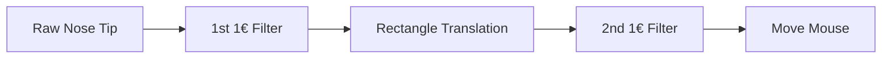

# Absolute Mouse Control

Absolute mouse position instead of relative movement as a secondary option. This is a proof of concept and not a finished product.

We use teh nose tip and extend a vector from the nose tip in the head direction using a PnP algorithm. The vector is then used to calculate the absolute mouse position. This mouse position is the filtered using a 1€ filter. This mouse position moves inside a rectangle superimposed on the nose tip. The rectangle is used to calculate the relative mouse position. The relative mouse position is then used to move the mouse.

## TODOs and Issues

- [ ] we need more aggressive filtering of the raw data
- [ ] we need to stabilize the nose tip while mouth is being opened
- [ ] we need to be aware of the distance of the user to the camera since our rectangle is fixed

-> Alternatively, we should use smaller gestures for triggering clicks.

## Acknowledgements

- [MediaPipe Demos by Rasmus Jones](https://github.com/Rassibassi/mediapipeDemos/)
- [1€ filter by Jaan Tollander de Balsch](https://github.com/jaantollander/OneEuroFilter/)
